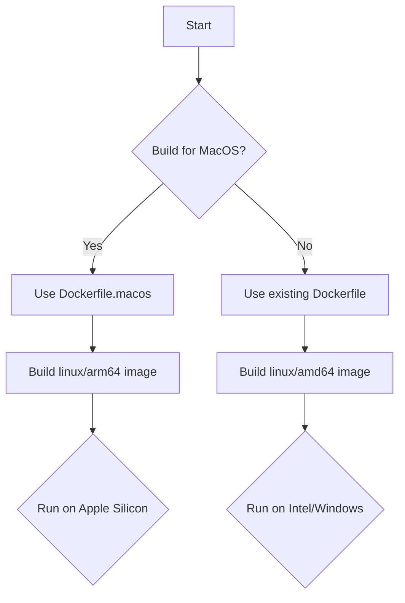

# Frontend Docker ARM64/MacOS Remediation Plan

## 1. Introduction

This document outlines the plan to create a dedicated `arm64` Docker build for the frontend application, specifically targeting macOS users with Apple Silicon (M1/M2) chips. This will ensure that developers on this architecture have a reliable and performant environment.

## 2. Plan Details

The core of this plan is to introduce a new, multi-stage Dockerfile and corresponding build scripts that are optimized for the `linux/arm64` platform.



### Step 1: Create `frontend/Dockerfile.macos`

A new `frontend/Dockerfile.macos` will be created. It will be a multi-stage build to ensure the final image is small and secure.

**`frontend/Dockerfile.macos`:**
```dockerfile
# Stage 1: Dependencies
FROM --platform=linux/arm64 node:20-alpine AS deps
WORKDIR /app
COPY package*.json ./
RUN npm ci --only=production

# Stage 2: Builder
FROM --platform=linux/arm64 node:20-alpine AS builder
WORKDIR /app
COPY package*.json ./
RUN npm ci
COPY . .
RUN npm run build

# Stage 3: Production
FROM --platform=linux/arm64 node:20-alpine
WORKDIR /app
COPY --from=deps /app/node_modules ./node_modules
COPY --from=builder /app/build ./build
COPY --from=builder /app/public ./public
COPY package.json ./

EXPOSE 3000
ENV NODE_ENV=production
ENV PORT=3000

HEALTHCHECK --interval=30s --timeout=10s --retries=3 \
    CMD node -e "require('http').get('http://localhost:3000', (r) => process.exit(r.statusCode === 200 ? 0 : 1))"

CMD ["npm", "start"]
```

### Step 2: Create `frontend/build-image-macos.sh`

A new build script, `frontend/build-image-macos.sh`, will be created to build the `arm64` image.

**`frontend/build-image-macos.sh`:**
```bash
#!/bin/bash
echo "Building Suno Frontend Docker Image for MacOS (arm64)..."
set -e

IMAGE_NAME="suno-frontend-macos"
IMAGE_TAG="latest"
FULL_IMAGE="$IMAGE_NAME:$IMAGE_TAG"

echo "Building Docker image: $FULL_IMAGE"
docker buildx build --platform linux/arm64 -f Dockerfile.macos -t $FULL_IMAGE .

echo "Successfully built $FULL_IMAGE"
```

### Step 3: Update `docker-compose.yml`

The main `docker-compose.yml` will be updated to allow for platform selection.

**`docker-compose.yml` changes:**
```yaml
services:
  frontend:
    platform: ${FRONTEND_PLATFORM:-linux/amd64}
    build:
      context: ./frontend
      dockerfile: Dockerfile
    # ... rest of the service definition
```

This change will allow developers to specify the platform in their `.env` file, like so:
`FRONTEND_PLATFORM=linux/arm64`

### Step 4: Documentation

The `README_DOCKER.md` file will be updated to include instructions for building and running the `arm64` image.

## 3. Next Steps

Once this plan is approved, I will switch to "code" mode to implement the changes.